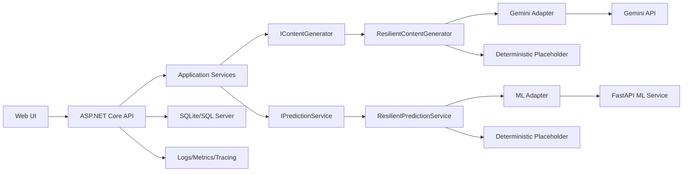

# AI Production Demo Plan - Spec-driven execution

## 1. Muc tieu

Tai lieu nay la ke hoach tich hop va trinh bay AI cho du an **AI Learning Path** theo phong cach spec-driven tuong tu Kiro: moi quyet dinh demo, moi hang muc production va moi phan viec cho AI agent deu co dau vao, dau ra, acceptance criteria va bang chung trong code.

Muc tieu cuoi:

- Demo ngan 5-7 phut nhung co ham luong ky thuat cao.
- Giam khao co the hoi sau ve kien truc, do tin cay, fallback, test va hieu nang.
- AI agent co the doc tai lieu nay va biet nen lam gi truoc, phan nao giao subagent, phan nao nam tren critical path.
- Neu nang len production, he thong co du backlog, SLA va tieu chi kiem chung ro rang.

## 2. Hien trang AI trong repo

### Da co the dung de demo

| Nang luc | Bang chung trong repo | Gia tri ky thuat khi trinh bay |
| --- | --- | --- |
| Sinh noi dung AI bang Gemini | `AiLearningPath/src/Infrastructure/Services/GeminiContentGenerator.cs` | Adapter HTTP that chuan hoa output ve cung schema voi placeholder. |
| Fallback an toan khi Gemini loi | `ResilientContentGenerator.cs`, `PlaceholderContentGenerator.cs` | Demo duoc reliability: dich vu ngoai loi nhung luong san pham van chay. |
| Du doan xac suat bang ML service | `MlPredictionService.cs`, `AiLearningPath/ml-service/app.py` | Tach ML thanh microservice Python + Scikit-learn, backend C# goi qua interface. |
| Academic Twin monotonic | `ml-service/app.py`, tests Twin/Prediction | Giai thich duoc rang buoc: tang gio hoc khong lam giam xac suat. |
| Spec-driven + property testing | `.kiro/specs/ai-learning-path/*.md`, `tests/AiLearningPath.Tests` | Co traceability tu requirement -> design -> task -> test. |
| Fallback deterministic | `PlaceholderContentGenerator.cs`, `PlaceholderPredictionService.cs` | Demo on/off AI that ma khong phu thuoc mang hoac API key. |
| UI demo end-to-end | `src/Api/wwwroot/app.html`, `app.js`, controllers | Co du flow nguoi dung: auth -> profile -> assessment -> DNA -> path -> dashboard -> twin -> career. Frontend hien tai la static HTML/CSS/vanilla JS, khong overclaim React/Tailwind. |

### Claim nen tranh neu chua bo sung them

- Khong noi "production-ready hoan toan" neu chua co observability, rate limit, secret management, cache, load test, auth giua API va ML service, va deployment pipeline.
- Khong noi "ML duoc train tu du lieu thuc" vi service hien tai dung synthetic deterministic data.
- Khong noi "Gemini luon tao cau hoi dung schema" vi adapter co normalize/fallback, nhung LLM output van can validation.
- Khong noi "React/Tailwind" neu UI hien tai la static HTML/CSS/vanilla JS trong `wwwroot`.
- Khong noi "Gemini/ML active mac dinh" vi cau hinh default co the dung placeholder khi chua co endpoint/key.
- Khong noi "Docker/Azure da san sang" neu chua co artifact deployment trong repo.

## 3. Demo script 5-7 phut

### 0:00-0:45 - Mo dau bang kien truc

Thong diep: "Day khong chi la app co nut AI; day la mot he thong AI co contract, fallback va test."

Trinh bay nhanh:

- Backend ASP.NET Core la API gateway va domain layer.
- Gemini chi nam sau `IContentGenerator`.
- ML Python chi nam sau `IPredictionService`.
- Business logic thuan duoc test bang property-based tests.

### 0:45-2:00 - Flow sinh learning path ca nhan hoa

Thao tac:

1. Dang nhap/dang ky.
2. Cap nhat profile va learning goal.
3. Lam AI assessment.
4. Tao Learning DNA.
5. Sinh learning path.

Noi ky thuat:

- Assessment/Path/Career khong goi Gemini truc tiep, ma goi `IContentGenerator`.
- Output Gemini duoc normalize ve schema noi bo.
- Khi thieu API key, placeholder deterministic van giu demo chay.

### 2:00-3:15 - Academic Twin + ML microservice

Thao tac:

1. Mo Academic Twin.
2. Nhap nhieu muc gio hoc moi ngay.
3. Cho thay xac suat tang hoac khong giam khi tang gio hoc.

Noi ky thuat:

- Backend map `PredictionFeatures` sang JSON va goi `POST /predict`.
- Python FastAPI dung LogisticRegression.
- Monotonicity la invariant duoc thiet ke va kiem thu, khong chi la cam tinh.

### 3:15-4:30 - Resilience demo

Hai cach demo:

- Cach an toan: de `Gemini` hoac `MlService` chua cau hinh trong `appsettings.Development.json`; app dung placeholder.
- Cach nang cao: cau hinh sai endpoint ML/Gemini; decorator log warning va fallback.

Noi ky thuat:

- `ResilientContentGenerator` va `ResilientPredictionService` la circuit-safety layer muc ung dung.
- Loi HTTP, timeout, JSON parse khong lam hong luong chinh.
- Day la diem khac giua "AI toy demo" va "AI product demo".

### 4:30-5:30 - Correctness + tests

Chay hoac trinh bay:

```powershell
dotnet test AiLearningPath/AiLearningPath.sln
```

Neu can test frontend:

```powershell
cd AiLearningPath/tests/frontend
npm test
```

Noi ky thuat:

- Property-based tests kiem tra bat bien: password policy, ownership, path coverage, progress score range, prediction probability, monotonicity, fallback.
- Test khong goi AI that trong unit/property tests de tranh flaky.

### 5:30-7:00 - Production-grade roadmap

Ket thuc bang thong diep:

- MVP da co contract AI, fallback, ML microservice va test.
- Production plan tiep theo la them caching, retry/circuit breaker chuan, observability, rate limit, secret management, load test va deployment.

## 4. Kien truc AI production-grade muc tieu



### Production principles

- AI output must be treated as untrusted input and validated against internal schema.
- External AI/ML failure must degrade gracefully, not break core flows.
- Unit/property tests must mock external AI/ML.
- Integration tests may call real services only when credentials/endpoints are explicitly configured.
- Latency must be bounded with timeout, cache and asynchronous fan-out where safe.
- Secrets must never live in committed appsettings.

## 5. Production hardening backlog

### P0 - Bat buoc truoc khi thi/demo

| ID | Hang muc | Owner de xuat | Acceptance criteria |
| --- | --- | --- | --- |
| P0.1 | Demo runbook | Main agent | Co file huong dan chay API, ML service, test, fallback; demo co the lap lai tren may khac. |
| P0.2 | Health check AI/ML | Backend subagent | API co endpoint/status hien thi Gemini configured/unconfigured, ML reachable/unreachable, fallback active. |
| P0.3 | Cau hinh an toan | Backend subagent | API key lay tu user-secrets/env var, khong commit secret; appsettings chi co placeholder. |
| P0.4 | ML service smoke test | ML subagent | `GET /health` va `POST /predict` co script kiem chung xac suat trong `[0,1]`. |
| P0.5 | Demo seed data | Frontend/API subagent | Co du lieu mau hoac flow tao nhanh de khong ton thoi gian nhap lieu khi thi. |
| P0.6 | Production secret guard | Security/config subagent | Production startup fail neu JWT key la placeholder/ngan hon 256 bit hoac secret lay tu committed config. |
| P0.7 | ML service auth | ML/security subagent | `/predict` tu choi request khong co shared secret/API key noi bo; API C# goi ML bang header an toan. |
| P0.8 | Cancellation semantics | Resilience subagent | `ResilientPredictionService` phan biet caller cancellation va internal timeout; caller cancellation khong trigger fallback work. |

### P1 - Nang ham luong ky thuat

| ID | Hang muc | Owner de xuat | Acceptance criteria |
| --- | --- | --- | --- |
| P1.1 | Structured AI schema validation | Backend subagent | Gemini response duoc validate bang schema/DTO; invalid -> fallback; log co reason. |
| P1.2 | Retry + circuit breaker | Backend subagent | External call co retry co gioi han, circuit open khi loi lien tiep; fallback khi circuit open. |
| P1.3 | Content cache | Backend subagent | Cache theo key `(kind, goal, paramsHash)` voi TTL; repeated prompt khong goi Gemini lai. |
| P1.4 | Prediction cache | Backend/ML subagent | Cache prediction theo feature hash; p95 local prediction < 100ms khi cache hit. |
| P1.5 | Observability | Platform subagent | Log co correlation id, provider, latency, fallback reason; metrics co success/fallback/timeout counts. |
| P1.6 | Load test | QA subagent | Script k6/JMeter hoac .NET load test: p95 API < 800ms voi placeholder/cache, error rate < 1%. |
| P1.7 | DI/config validation | Backend subagent | `GeminiOptions`, `MlServiceOptions`, JWT va DB mode co `ValidateOnStart`; placeholder mode explicit trong Production. |
| P1.8 | Contract tests | QA subagent | Test C# `MlPredictionService` JSON contract khop FastAPI `PredictRequest`; test DI switching configured/unconfigured. |

### P2 - Production mo rong

| ID | Hang muc | Owner de xuat | Acceptance criteria |
| --- | --- | --- | --- |
| P2.1 | Background jobs | Backend subagent | Sinh path/career dai chay async, UI poll status; request ngan khong bi timeout. |
| P2.2 | Model artifact lifecycle | ML subagent | Model duoc save/load artifact `.pkl`; startup khong train lai neu artifact ton tai. |
| P2.3 | Data feedback loop | Data subagent | Luu feedback/chat/result de cai thien prompt/model; co schema migration. |
| P2.4 | Rate limiting | Platform subagent | Moi user co quota request AI; qua quota tra 429 co message ro. |
| P2.5 | Deployment profile | Platform subagent | Docker compose gom API + ML + DB; health checks pass truoc khi expose. |
| P2.6 | Academic Twin batching | Resilience/perf subagent | `SimulateRangeAsync` khong goi ML unbounded sequential; 10 predictions hoan thanh < 3x single-call p95 hoac dung batch endpoint. |
| P2.7 | Supply chain hygiene | Platform subagent | Pin Python deps, scan NuGet/Python vulnerabilities, remove `__pycache__`, co CI gate cho test/lint. |

## 6. Subagent execution map

### Nguyen tac chia viec

- Main agent giu critical path: spec, kien truc tong the, integration decisions, merge/review.
- Subagent chi lam viec co output doc lap, file ownership ro, khong cung sua mot file neu khong can.
- Explorer subagent dung de doc va tra loi cau hoi cu the.
- Worker subagent dung de sua code trong pham vi file duoc giao.
- Moi subagent phai tra ve: file da doc/sua, acceptance criteria da dat, lenh da chay, rui ro con lai.

### Nen dung subagent o dau

| Workstream | Nen dung subagent? | Ly do | File ownership goi y |
| --- | --- | --- | --- |
| Backend resilience | Co | Doc lap voi UI/ML, tac dong ky thuat cao. | `Infrastructure/Services/*`, tests `ExternalServices/*` |
| ML service | Co | Python service doc lap, co the toi uu song song. | `AiLearningPath/ml-service/*` |
| Frontend demo UX | Co | Co the cai demo seed, status badge, loading/fallback UI rieng. | `src/Api/wwwroot/*` |
| QA/test audit | Co | Co the chay test, viet smoke script, khong can block coding. | `tests/*`, `scripts/*` |
| Documentation/runbook | Co, neu main dang code | It conflict, co the chuan hoa song song. | `.kiro/specs/*`, `README.md` |
| Security/config | Co | Guardrail secrets/auth/production startup doc lap voi AI logic. | `appsettings*.json`, options, startup validation, ML auth config |
| Observability/perf | Co | Metrics, latency va load scripts co the lam song song. | logging/metrics wrappers, `tests`, `scripts` |
| Core domain invariants | Main agent hoac worker rat can than | Anh huong rong, de tao regression neu chia nho sai. | `src/Domain/*`, `src/Application/*` |
| DI composition `Program.cs` | Main agent | La diem hop nhat cac workstream, de conflict. | `src/Api/Program.cs` |

### Parallel waves de AI lam nhanh nhat

```json
{
  "wave_0_local_main": [
    "Doc spec hien tai",
    "Xac dinh demo path",
    "Khoa file ownership cho subagents"
  ],
  "wave_1_parallel": [
    {
      "agent": "backend-resilience-worker",
      "scope": "schema validation, retry/circuit breaker, caller cancellation semantics, tests",
      "files": ["Infrastructure/Services", "tests/ExternalServices"]
    },
    {
      "agent": "ml-worker",
      "scope": "model artifact, health/readiness, internal auth, smoke, monotonic script",
      "files": ["ml-service"]
    },
    {
      "agent": "frontend-demo-worker",
      "scope": "demo seed/status UI/loading fallback labels",
      "files": ["src/Api/wwwroot"]
    },
    {
      "agent": "qa-worker",
      "scope": "test matrix, contract tests, run commands, report flaky/failing tests",
      "files": ["tests", "scripts"]
    },
    {
      "agent": "security-config-worker",
      "scope": "secret guardrails, option validation, production config checks",
      "files": ["src/Api/appsettings*.json", "Infrastructure/Services/ExternalServiceOptions.cs", "src/Api/Program.cs"]
    }
  ],
  "wave_2_main_integration": [
    "Review patches",
    "Resolve DI/config conflicts",
    "Run full test suite",
    "Update runbook and final judging checklist"
  ],
  "wave_3_parallel_optional": [
    "load-test-worker",
    "security-config-worker",
    "deployment-worker"
  ]
}
```

## 7. Acceptance criteria production-grade

### Functional AI

- Assessment, Learning Path va Career Path deu chay duoc khi Gemini configured.
- Cung flow van chay khi Gemini unconfigured/timeout/error nho placeholder fallback.
- Academic Twin tra xac suat trong `[0,1]`.
- Voi cung feature, neu `hoursPerDay` tang thi xac suat khong giam.

### Latency

| Scenario | Target |
| --- | --- |
| API placeholder path | p95 < 300ms |
| ML local `/predict` | p95 < 50ms inference, excluding network |
| API single ML prediction | p95 < 300ms khi ML healthy |
| Academic Twin 10-point range | p95 < 800ms hoac < 3x single-call p95 |
| Gemini uncached call | timeout <= 30s, co fallback |
| Cached content generation | p95 < 200ms |
| Dashboard load | p95 < 500ms voi du lieu demo |

### Reliability

- Fallback rate duoc log/metric rieng.
- 100% loi provider AI/ML da biet khong lam API 500 o luong demo chinh.
- Timeout, HTTP error, invalid JSON deu co test.
- Startup khong phu thuoc Gemini API key.
- Caller cancellation duoc propagate, khong bi che bang fallback.
- ML service co `/health` cho liveness va `/ready` cho loaded-model readiness truoc production.

### Security

- JWT bao ve cac route du lieu ca nhan.
- Ownership authorization tra 403 khi truy cap tai nguyen nguoi khac.
- API key khong commit vao repo.
- Prompt khong dua secret hoac token vao payload AI.
- Co rate limit cho endpoint tao noi dung AI truoc production.
- ML `/predict` production phai co auth noi bo.
- Gemini key chi gui qua mot co che duoc phe duyet, uu tien header, va khong log.
- JWT key production toi thieu 256 bit va khac placeholder.

### Observability

Moi lan goi AI/ML can co log structured:

- `provider`: `gemini`, `ml-service`, `placeholder`
- `operation`: `assessment`, `learning-path`, `career-path`, `prediction`
- `latencyMs`
- `result`: `success`, `fallback`, `timeout`, `invalid-json`, `http-error`
- `correlationId`

## 8. Demo checklist

### Truoc khi trinh bay

- [ ] Chay `dotnet test AiLearningPath/AiLearningPath.sln`.
- [ ] Chay ML service va test `GET /health`.
- [ ] Test `POST /predict` voi 2 muc gio hoc de xac nhan xac suat khong giam.
- [ ] Mo app va tao duoc flow nguoi dung moi.
- [ ] Co san endpoint fallback demo: Gemini/ML unconfigured hoac endpoint sai.
- [ ] Xoa/che API key trong man hinh khi quay/chieu.
- [ ] Chuan bi cau tra loi ngan ve synthetic ML data.

### Cau tra loi nhanh cho giam khao kho tinh

**Hoi: Neu Gemini loi thi sao?**

Tra loi: Backend khong goi Gemini truc tiep tu domain service. Tat ca qua `IContentGenerator`; `ResilientContentGenerator` bat HTTP/timeout/JSON error va fallback ve deterministic placeholder cung schema, nen flow khong gay 500.

**Hoi: ML nay co dang tin khong?**

Tra loi: Ban demo dung LogisticRegression tren du lieu synthetic deterministic de chung minh kien truc ML-service, contract va invariant monotonic. Production backlog da tach ro viec thay bang du lieu thuc, model artifact lifecycle va feedback loop.

**Hoi: Neu nguoi dung tat request giua chung thi sao?**

Tra loi: Day la mot diem production-hardening da duoc dua vao P0. Content fallback da ton trong caller cancellation; prediction fallback can can chinh de khong lam viec thua khi client disconnect hoac app shutdown.

**Hoi: Vi sao noi spec-driven?**

Tra loi: Repo co `requirements.md`, `design.md`, `tasks.md`; moi requirement map sang component, interface va test. Property-based tests kiem tra invariant thay vi chi test example.

**Hoi: Co phai chi la prompt engineering?**

Tra loi: Khong. Prompt chi la mot adapter. Gia tri ky thuat nam o contract, schema normalization, fallback, ML microservice, authorization, persistence va property testing.

## 9. Lenh van hanh nhanh

### Backend

```powershell
dotnet run --project AiLearningPath/src/Api/AiLearningPath.Api.csproj
```

### Test backend

```powershell
dotnet test AiLearningPath/AiLearningPath.sln
```

### ML service

```powershell
cd AiLearningPath/ml-service
python -m venv .venv
.\\.venv\\Scripts\\Activate.ps1
pip install -r requirements.txt
uvicorn app:app --reload --port 8001
```

### Smoke ML

```powershell
Invoke-RestMethod http://localhost:8001/health
Invoke-RestMethod http://localhost:8001/predict -Method Post -ContentType 'application/json' -Body '{"currentLevelScore":60,"hoursPerDay":2,"goalType":"GPA","targetDays":90}'
Invoke-RestMethod http://localhost:8001/predict -Method Post -ContentType 'application/json' -Body '{"currentLevelScore":60,"hoursPerDay":4,"goalType":"GPA","targetDays":90}'
```

## 10. Definition of done cho AI agent

Mot AI agent chi duoc danh dau xong khi:

- Da cap nhat spec/task lien quan neu thay doi behavior.
- Da co test cho behavior moi hoac ly do ro neu chua the test.
- Da chay lenh verify gan nhat trong pham vi no sua.
- Da khong commit secret, key, token.
- Da ghi ro fallback/latency/security impact.
- Neu la subagent, da tra lai danh sach file sua va rui ro con lai de main agent review.
