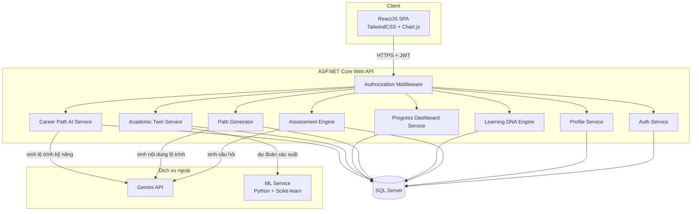
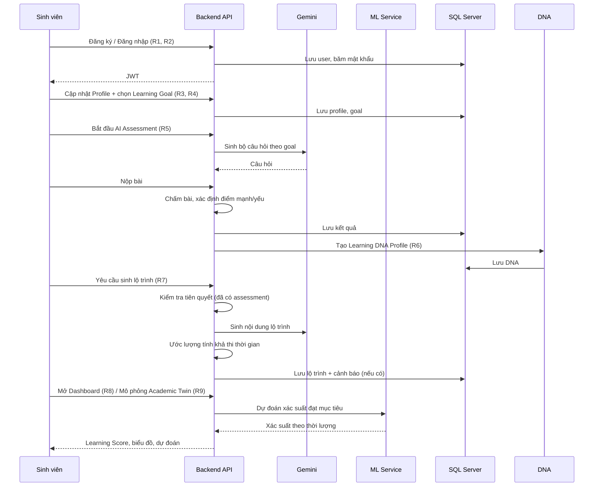
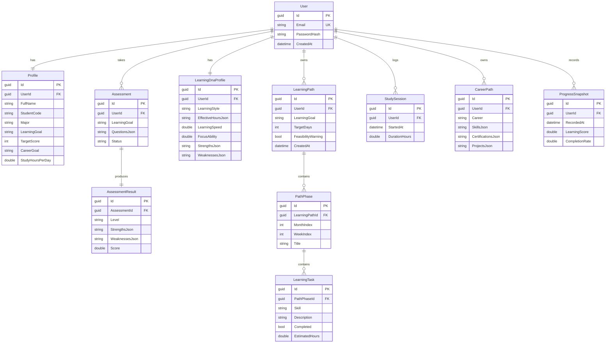

# Tài liệu Thiết kế Kỹ thuật — AI Learning Path

## Overview

AI Learning Path là nền tảng web cố vấn học tập số ứng dụng AI. Tài liệu thiết kế này tập trung vào phạm vi **MVP cốt lõi** gồm 7 nhóm chức năng: Authentication & Profile, AI Assessment, Learning DNA Engine, AI Learning Path Generator, Progress Tracking Dashboard, AI Academic Twin và Career Path AI. Các chức năng mở rộng (Smart Study Scheduler, Adaptive Learning, AI Tutor) được phản ánh trong kiến trúc để đảm bảo khả năng mở rộng nhưng không nằm trong phạm vi triển khai MVP.

### Mục tiêu thiết kế

- **Cá nhân hóa**: Lộ trình, dự đoán và đề xuất bám sát hồ sơ học tập riêng của từng sinh viên (Learning DNA).
- **Tách biệt trách nhiệm**: Logic nghiệp vụ thuần (chấm điểm, tính Learning Score, validation, ước lượng khả thi) được tách khỏi lời gọi dịch vụ AI/ML bên ngoài để dễ kiểm thử và bảo trì.
- **Bảo mật theo chủ sở hữu dữ liệu**: Mọi truy cập tài nguyên đều được kiểm soát theo tài khoản đã xác thực (ownership-based authorization).
- **Khả năng kiểm thử**: Các thành phần logic được thiết kế dưới dạng hàm thuần (pure function) nhận đầu vào / trả đầu ra rõ ràng, cho phép property-based testing.

### Công nghệ

| Lớp | Công nghệ |
|-----|-----------|
| Frontend | ReactJS, TailwindCSS, Chart.js |
| Backend API | ASP.NET Core Web API (C#) |
| Database | SQL Server (Entity Framework Core) |
| AI sinh nội dung | Gemini API |
| ML dự đoán | Python + Scikit-learn (microservice) |
| Xác thực | JWT (Bearer token) |
| Triển khai | Docker, Azure (App Service + Azure SQL) |

### Ánh xạ phạm vi với Requirements

| Nhóm chức năng | Requirements |
|----------------|--------------|
| Authentication & Profile | R1, R2, R3, R4, R14 |
| AI Assessment | R5 |
| Learning DNA Engine | R6 |
| AI Learning Path Generator | R7 |
| Progress Tracking Dashboard | R8 |
| AI Academic Twin | R9 |
| Career Path AI | R10 |
| Mở rộng (ngoài MVP) | R11, R12, R13 |

## Architecture

### Kiến trúc tổng thể

Hệ thống áp dụng kiến trúc phân lớp với một microservice ML riêng biệt. Backend ASP.NET Core đóng vai trò API Gateway và chứa logic nghiệp vụ; các tác vụ sinh nội dung gọi Gemini API; các tác vụ dự đoán xác suất gọi ML Service (Python).



### Luồng nghiệp vụ chính



### Nguyên tắc tách lớp

Mỗi service backend được chia thành 3 lớp:

1. **Controller (API endpoint)**: Nhận request, xác thực JWT, ủy quyền cho Application Service.
2. **Application Service**: Điều phối nghiệp vụ, gọi domain logic và repository, tích hợp dịch vụ ngoài qua interface.
3. **Domain Logic (pure functions)**: Chấm điểm, tính Learning Score, validation, ước lượng khả thi, xây dựng cấu trúc lộ trình — không phụ thuộc I/O, dễ kiểm thử bằng property-based testing.

Dịch vụ ngoài (Gemini, ML Service) được trừu tượng hóa qua interface (`IContentGenerator`, `IPredictionService`) để có thể mock trong kiểm thử.

## Components and Interfaces

### 1. Auth Service (R1, R2)

Chịu trách nhiệm đăng ký, đăng nhập, sinh và xác minh JWT.

```csharp
public interface IAuthService
{
    Task<RegisterResult> RegisterAsync(string email, string password);
    Task<LoginResult> LoginAsync(string email, string password);
    ClaimsPrincipal? ValidateToken(string jwt);
}

// Domain logic thuần (kiểm thử được)
public static class PasswordPolicy
{
    public static ValidationResult Validate(string password); // >= 8 ký tự
}

public static class PasswordHasher
{
    public static string Hash(string password);        // bcrypt/PBKDF2
    public static bool Verify(string password, string hash);
}
```

- Validation độ dài mật khẩu và kiểm tra trùng email là logic thuần.
- Mật khẩu lưu dưới dạng hash (bcrypt/PBKDF2 với salt).

### 2. Profile Service (R3, R4)

Quản lý hồ sơ và lựa chọn Learning Goal.

```csharp
public interface IProfileService
{
    Task<Profile> CreateOrUpdateAsync(Guid userId, ProfileInput input);
    Task<Profile> GetAsync(Guid userId);
    Task<Profile> UpdateFieldAsync(Guid userId, string field, object value);
    Task<Profile> SelectGoalAsync(Guid userId, LearningGoalSelection selection);
}

public static class ProfileValidator
{
    // studyHoursPerDay phải nằm trong [0, 24]
    public static ValidationResult ValidateStudyHours(double hours);
    // Learning Goal phải thuộc danh sách hỗ trợ
    public static ValidationResult ValidateGoal(string goal);
}

public static class LearningGoalCatalog
{
    public static readonly IReadOnlySet<string> Supported = new HashSet<string>
    {
        "IELTS", "TOEIC", "UniversitySubject",
        "FrontendDevelopment", "BackendDevelopment",
        "DataAnalyst", "AIEngineer"
    };
    public static bool RequiresTargetScore(string goal); // IELTS, TOEIC
}
```

### 3. Assessment Engine (R5)

Tạo bộ câu hỏi (qua Gemini), chấm bài, xác định điểm mạnh/yếu.

```csharp
public interface IAssessmentEngine
{
    Task<Assessment> StartAsync(Guid userId, string learningGoal);
    Task<AssessmentResult> SubmitAsync(Guid userId, Guid assessmentId, IReadOnlyList<Answer> answers);
}

// Logic thuần
public static class AssessmentGrader
{
    // Chấm bài: tính điểm theo từng skill area, suy ra trình độ, điểm mạnh/yếu
    public static AssessmentResult Grade(Assessment assessment, IReadOnlyList<Answer> answers);

    // Kiểm tra đầy đủ câu trả lời trước khi nộp
    public static ValidationResult ValidateCompleteness(Assessment assessment, IReadOnlyList<Answer> answers);
}
```

- `IContentGenerator` (bọc Gemini) sinh câu hỏi theo Learning Goal.
- `AssessmentGrader.Grade` là hàm thuần: cùng bộ câu hỏi + câu trả lời luôn cho cùng kết quả.

### 4. Learning DNA Engine (R6)

Xây dựng và cập nhật Learning DNA Profile.

```csharp
public interface ILearningDnaEngine
{
    Task<LearningDnaProfile> BuildAsync(Guid userId, AssessmentResult result);
    Task<LearningDnaProfile> UpdateAsync(Guid userId, ProgressData newData);
    Task<LearningDnaProfile> GetAsync(Guid userId);
}

// Logic thuần
public static class DnaBuilder
{
    public static LearningDnaProfile Build(AssessmentResult result, ProfileInput profile);
    public static LearningDnaProfile Merge(LearningDnaProfile current, ProgressData newData);
}
```

### 5. Path Generator (R7)

Sinh lộ trình cá nhân hóa chia theo tháng/tuần/ngày.

```csharp
public interface IPathGenerator
{
    Task<LearningPath> GenerateAsync(Guid userId);
}

// Logic thuần
public static class PathBuilder
{
    // Kiểm tra tiên quyết: phải có AssessmentResult
    public static ValidationResult CheckPrerequisites(StudentContext ctx);

    // Xây cấu trúc lộ trình theo tháng -> tuần -> ngày
    public static LearningPath Build(LearningGoal goal, AssessmentResult result,
        LearningDnaProfile dna, int targetDays, string aiContent);

    // Ước lượng tính khả thi của khoảng thời gian mục tiêu
    public static FeasibilityResult AssessFeasibility(LearningPath path, int targetDays);
}
```

### 6. Progress Dashboard Service (R8)

Tổng hợp Learning Score, tỷ lệ hoàn thành, giờ học, dữ liệu biểu đồ.

```csharp
public interface IProgressDashboardService
{
    Task<DashboardView> GetDashboardAsync(Guid userId);
    Task<DashboardView> CompleteTaskAsync(Guid userId, Guid taskId);
}

// Logic thuần
public static class ProgressCalculator
{
    public static double ComputeCompletionRate(LearningPath path);   // [0, 1]
    public static double ComputeLearningScore(ProgressSnapshot snap); // [0, 100]
    public static double ComputeTotalStudyHours(IReadOnlyList<StudySession> sessions);
    public static ChartData BuildChartData(IReadOnlyList<ProgressSnapshot> history);
}
```

### 7. Academic Twin Service (R9)

Mô phỏng và dự đoán xác suất đạt mục tiêu theo thời lượng học.

```csharp
public interface IAcademicTwinService
{
    Task<Prediction> SimulateAsync(Guid userId, double hoursPerDay);
    Task<IReadOnlyList<Prediction>> SimulateRangeAsync(Guid userId, IReadOnlyList<double> hoursOptions);
}

public interface IPredictionService // bọc ML Service
{
    Task<double> PredictSuccessProbabilityAsync(PredictionFeatures features);
}

// Logic thuần
public static class TwinValidator
{
    // Tiên quyết: có Learning Goal + AssessmentResult
    public static ValidationResult CheckPrerequisites(StudentContext ctx);
}
```

### 8. Career Path AI Service (R10)

Sinh lộ trình kỹ năng và đề xuất chứng chỉ/dự án.

```csharp
public interface ICareerPathService
{
    IReadOnlyList<string> ListCareers(); // Frontend, Backend, Data Analyst, AI Engineer, Tester
    Task<CareerPath> GenerateAsync(Guid userId, string career);
}

public static class CareerCatalog
{
    public static readonly IReadOnlyList<string> Careers = new[]
    {
        "Frontend", "Backend", "DataAnalyst", "AIEngineer", "Tester"
    };
}
```

### 9. Authorization Middleware (R14)

Middleware xác minh JWT và áp dụng ownership-based authorization cho mọi tài nguyên gắn `userId`.

```csharp
public interface IResourceAuthorizer
{
    // Trả về true nếu requesterId là chủ sở hữu của tài nguyên
    bool CanAccess(Guid requesterId, Guid resourceOwnerId);
}
```

- JWT không hợp lệ/hết hạn → 401.
- Truy cập tài nguyên của tài khoản khác → 403.

## Data Models

### Sơ đồ thực thể



### Mô tả các kiểu dữ liệu chính

- **User**: Tài khoản đăng nhập. `Email` duy nhất, `PasswordHash` lưu hash.
- **Profile**: Hồ sơ cá nhân; `StudyHoursPerDay ∈ [0, 24]`; `LearningGoal` thuộc danh mục hỗ trợ; `TargetScore` nullable (chỉ với IELTS/TOEIC).
- **Assessment / AssessmentResult**: Bài đánh giá và kết quả (trình độ, điểm mạnh/yếu, điểm số).
- **LearningDnaProfile**: Hồ sơ học tập (phong cách, khung giờ hiệu quả, tốc độ, khả năng tập trung, điểm mạnh/yếu).
- **LearningPath → PathPhase → LearningTask**: Lộ trình phân cấp tháng → tuần → ngày/nhiệm vụ.
- **CareerPath**: Lộ trình nghề nghiệp (kỹ năng, chứng chỉ, dự án).
- **ProgressSnapshot / StudySession**: Dữ liệu tiến độ phục vụ dashboard và dự đoán.

### Quy ước

- Các trường danh sách phức tạp (questions, strengths, skills...) lưu dưới dạng JSON trong SQL Server (`nvarchar(max)`), với round-trip serialization được kiểm thử.
- Mọi thực thể dữ liệu học tập đều có `UserId` để áp dụng ownership-based authorization.

## Correctness Properties

*Một property (thuộc tính) là một đặc điểm hoặc hành vi phải luôn đúng trên mọi lần thực thi hợp lệ của hệ thống — về bản chất là một phát biểu hình thức về những gì hệ thống phải làm. Properties đóng vai trò cầu nối giữa đặc tả dễ đọc cho con người và các đảm bảo đúng đắn có thể kiểm chứng bằng máy.*

Các property dưới đây được rút ra từ phần prework phân tích acceptance criteria. Mỗi property là một phát biểu lượng từ phổ quát ("với mọi"), được dùng để sinh property-based test. Các tiêu chí thuộc loại EXAMPLE/EDGE_CASE/INTEGRATION/SMOKE (ví dụ: gọi Gemini/ML, hiển thị UI, trạng thái rỗng dashboard) được xử lý ở phần Testing Strategy thay vì ở đây.

Sau bước reflection để loại bỏ trùng lặp, danh sách property hợp nhất như sau.

### Property 1: Mật khẩu ngắn luôn bị từ chối

*Với mọi* chuỗi mật khẩu có độ dài nhỏ hơn 8 ký tự, `PasswordPolicy.Validate` SHALL trả về kết quả không hợp lệ; và với mọi mật khẩu có độ dài từ 8 ký tự trở lên, SHALL trả về kết quả hợp lệ.

**Validates: Requirements 1.3**

### Property 2: Băm mật khẩu round-trip

*Với mọi* mật khẩu hợp lệ, `PasswordHasher.Verify(password, PasswordHasher.Hash(password))` SHALL trả về `true`, và giá trị hash SHALL khác với mật khẩu thuần.

**Validates: Requirements 1.4**

### Property 3: Đăng ký email trùng bị từ chối

*Với mọi* tập tài khoản đã tồn tại và một email bất kỳ thuộc tập đó, yêu cầu đăng ký với email đó SHALL bị từ chối, và tổng số tài khoản SHALL không thay đổi.

**Validates: Requirements 1.1, 1.2**

### Property 4: Validation số giờ học mỗi ngày

*Với mọi* số thực `h`, `ProfileValidator.ValidateStudyHours(h)` SHALL trả về hợp lệ khi và chỉ khi `0 <= h <= 24`.

**Validates: Requirements 3.4**

### Property 5: Chỉ chấp nhận Learning Goal được hỗ trợ

*Với mọi* chuỗi mục tiêu học tập, `ProfileValidator.ValidateGoal` SHALL trả về hợp lệ khi và chỉ khi chuỗi đó thuộc danh mục `LearningGoalCatalog.Supported`.

**Validates: Requirements 4.1, 4.2, 4.4**

### Property 6: Chấm bài đánh giá có tính xác định

*Với mọi* bộ câu hỏi và tập câu trả lời, việc gọi `AssessmentGrader.Grade` nhiều lần với cùng đầu vào SHALL luôn tạo ra cùng một kết quả (trình độ, điểm mạnh, điểm yếu, điểm số).

**Validates: Requirements 5.2**

### Property 7: Nộp bài thiếu câu trả lời bị từ chối

*Với mọi* bài đánh giá và tập câu trả lời, `AssessmentGrader.ValidateCompleteness` SHALL trả về hợp lệ khi và chỉ khi mọi câu hỏi trong bài đều đã được trả lời.

**Validates: Requirements 5.4**

### Property 8: Điểm mạnh và điểm yếu tách biệt

*Với mọi* kết quả đánh giá do `AssessmentGrader.Grade` tạo ra, tập điểm mạnh và tập điểm yếu SHALL không có phần tử chung (không một kỹ năng nào vừa là điểm mạnh vừa là điểm yếu).

**Validates: Requirements 5.2**

### Property 9: Sinh lộ trình yêu cầu hoàn thành đánh giá

*Với mọi* ngữ cảnh sinh viên, `PathBuilder.CheckPrerequisites` SHALL trả về hợp lệ khi và chỉ khi ngữ cảnh đó đã có một `AssessmentResult`.

**Validates: Requirements 7.4**

### Property 10: Lộ trình bao phủ toàn bộ thời gian mục tiêu

*Với mọi* lộ trình do `PathBuilder.Build` tạo ra với `targetDays` ngày, tổng số ngày của tất cả các giai đoạn (phase) SHALL bằng `targetDays`, và các giai đoạn được tổ chức phân cấp theo tháng → tuần → ngày mà không có khoảng trống hay chồng lấn.

**Validates: Requirements 7.1, 7.2**

### Property 11: Cảnh báo khả thi khi thời gian không đủ

*Với mọi* lộ trình và `targetDays`, `PathBuilder.AssessFeasibility` SHALL gắn cảnh báo khi và chỉ khi tổng số giờ học ước lượng của lộ trình vượt quá tổng số giờ khả dụng trong `targetDays`.

**Validates: Requirements 7.5**

### Property 12: Tỷ lệ hoàn thành luôn nằm trong [0, 1]

*Với mọi* lộ trình học tập, `ProgressCalculator.ComputeCompletionRate` SHALL trả về giá trị trong khoảng `[0, 1]`, và giá trị đó SHALL bằng tỷ số giữa số nhiệm vụ đã hoàn thành và tổng số nhiệm vụ.

**Validates: Requirements 8.1, 8.2**

### Property 13: Learning Score luôn nằm trong [0, 100]

*Với mọi* ảnh chụp tiến độ (progress snapshot), `ProgressCalculator.ComputeLearningScore` SHALL trả về giá trị trong khoảng `[0, 100]`.

**Validates: Requirements 8.1, 8.2**

### Property 14: Tổng số giờ học bằng tổng các phiên học

*Với mọi* danh sách phiên học (study sessions), `ProgressCalculator.ComputeTotalStudyHours` SHALL trả về giá trị bằng tổng thời lượng của tất cả các phiên, và SHALL không âm.

**Validates: Requirements 8.1**

### Property 15: Hoàn thành nhiệm vụ làm tỷ lệ hoàn thành không giảm

*Với mọi* lộ trình và một nhiệm vụ chưa hoàn thành bất kỳ, sau khi đánh dấu nhiệm vụ đó hoàn thành, tỷ lệ hoàn thành kế hoạch SHALL lớn hơn hoặc bằng giá trị trước đó.

**Validates: Requirements 8.2**

### Property 16: Mô phỏng Academic Twin yêu cầu tiên quyết

*Với mọi* ngữ cảnh sinh viên, `TwinValidator.CheckPrerequisites` SHALL trả về hợp lệ khi và chỉ khi ngữ cảnh có cả Learning Goal lẫn `AssessmentResult`.

**Validates: Requirements 9.4**

### Property 17: Xác suất đạt mục tiêu là một giá trị xác suất hợp lệ

*Với mọi* tập đặc trưng dự đoán (prediction features), xác suất đạt mục tiêu do Academic Twin trả về SHALL nằm trong khoảng `[0, 1]`.

**Validates: Requirements 9.1, 9.2**

### Property 18: Mô phỏng nhiều mức thời lượng đầy đủ và đơn điệu

*Với mọi* danh sách các mức thời lượng học mỗi ngày, `SimulateRangeAsync` SHALL trả về đúng một dự đoán cho mỗi mức (số lượng kết quả bằng số lượng đầu vào); và khi tăng thời lượng học mỗi ngày, xác suất đạt mục tiêu SHALL không giảm.

**Validates: Requirements 9.1, 9.2**

### Property 19: Phân quyền theo chủ sở hữu dữ liệu

*Với mọi* cặp định danh người yêu cầu và chủ sở hữu tài nguyên, `IResourceAuthorizer.CanAccess` SHALL trả về `true` khi và chỉ khi hai định danh trùng nhau.

**Validates: Requirements 14.1, 14.2**

### Property 20: Round-trip serialization dữ liệu JSON

*Với mọi* đối tượng miền được lưu dưới dạng JSON (bộ câu hỏi, điểm mạnh/yếu, lộ trình kỹ năng, khung giờ hiệu quả...), việc serialize rồi deserialize SHALL tạo ra một đối tượng tương đương với đối tượng ban đầu.

**Validates: Requirements 5.3, 6.2, 7.3, 10.4**

## Error Handling

### Nguyên tắc chung

- API trả về mã trạng thái HTTP chuẩn và body lỗi nhất quán:

```json
{ "error": { "code": "VALIDATION_ERROR", "message": "Mô tả lỗi rõ ràng", "details": {} } }
```

- Lỗi validation nghiệp vụ → `400 Bad Request`.
- Thiếu/không hợp lệ/hết hạn JWT → `401 Unauthorized` (R2.4, R14.3).
- Truy cập tài nguyên của người khác → `403 Forbidden` (R14.2).
- Tài nguyên không tồn tại → `404 Not Found`.
- Lỗi nội bộ → `500 Internal Server Error` (không lộ chi tiết hệ thống).

### Bảng xử lý lỗi theo tình huống

| Tình huống | Requirement | Xử lý |
|-----------|-------------|-------|
| Email đăng ký đã tồn tại | R1.2 | 400 + thông báo email đã dùng |
| Mật khẩu < 8 ký tự | R1.3 | 400 + thông báo yêu cầu độ dài |
| Sai email/mật khẩu khi đăng nhập | R2.2 | 401 + thông báo lỗi xác thực |
| JWT không hợp lệ/hết hạn | R2.4, R14.3 | 401 + yêu cầu đăng nhập lại |
| Truy cập dữ liệu tài khoản khác | R14.2 | 403 |
| Số giờ học ngoài [0, 24] | R3.4 | 400 + thông báo khoảng hợp lệ |
| Learning Goal không được hỗ trợ | R4.4 | 400 + thông báo lựa chọn không hợp lệ |
| Nộp bài còn câu hỏi trống | R5.4 | 400 + yêu cầu hoàn thành tất cả câu hỏi |
| Sinh lộ trình khi chưa làm assessment | R7.4 | 400 + yêu cầu hoàn thành đánh giá |
| Thời gian mục tiêu không đủ | R7.5 | 200 + lộ trình kèm `feasibilityWarning = true` |
| Mô phỏng Twin thiếu tiên quyết | R9.4 | 400 + yêu cầu hoàn thành bước tiên quyết |

### Xử lý lỗi dịch vụ ngoài

- **Gemini API / ML Service**: Áp dụng timeout, retry có giới hạn (exponential backoff) và circuit breaker. Khi quá thời gian chờ tối đa hoặc dịch vụ không phản hồi, trả về `503 Service Unavailable` kèm thông báo đề nghị thử lại (định hướng cho R13.3 ở giai đoạn mở rộng).
- Lời gọi dịch vụ ngoài được bọc qua interface (`IContentGenerator`, `IPredictionService`) nên có thể mock trong kiểm thử mà không phụ thuộc mạng.

## Testing Strategy

Áp dụng phương pháp kiểm thử kép: **unit test** cho ví dụ cụ thể, edge case và điểm tích hợp; **property-based test** cho các thuộc tính phổ quát trên toàn không gian đầu vào.

### Property-Based Testing

PBT phù hợp với feature này vì phần lớn logic nghiệp vụ cốt lõi là **hàm thuần**: validation, chấm điểm, tính Learning Score/tỷ lệ hoàn thành, ước lượng khả thi, xây dựng cấu trúc lộ trình, kiểm tra phân quyền và serialization JSON.

**Cấu hình:**
- Thư viện đề xuất: **FsCheck** (cho backend C#/.NET). Không tự hiện thực framework PBT.
- Mỗi property test chạy tối thiểu **100 iteration**.
- Mỗi property test tham chiếu tới property tương ứng trong tài liệu thiết kế bằng comment theo định dạng:
  `// Feature: ai-learning-path, Property {số}: {nội dung property}`
- Mỗi correctness property (Property 1–20) được hiện thực bằng **một** property-based test.
- Dịch vụ ngoài (Gemini, ML) được **mock** để kiểm thử logic độc lập với I/O. Property 17 và 18 kiểm thử lớp logic của Academic Twin với `IPredictionService` được mock (hoặc dùng mô hình tham chiếu đơn điệu) — không gọi ML Service thật.

**Lưu ý đặc biệt:** Property 20 (round-trip serialization) là bắt buộc cho mọi dữ liệu lưu dạng JSON, theo khuyến nghị luôn round-trip cho serializer/parser.

### Unit & Example-Based Tests

Dùng cho các tiêu chí không phù hợp PBT:
- **EXAMPLE**: Tạo tài khoản thành công và lưu DB (R1.1), trả JWT khi đăng nhập đúng (R2.1), cho phép truy cập với JWT hợp lệ (R2.3), CRUD hồ sơ (R3.1–3.3), lưu lựa chọn goal (R4.2–4.3), danh mục nghề nghiệp (R10.1), sinh lộ trình kỹ năng + chứng chỉ/dự án (R10.2–10.3).
- **EDGE_CASE**: Dashboard trạng thái rỗng kèm hướng dẫn (R8.4), nhập điểm mục tiêu cho goal yêu cầu điểm (R4.3), bộ câu trả lời rỗng/toàn bộ trống.

### Integration Tests

Dùng cho điểm tích hợp với dịch vụ ngoài và hạ tầng (1–3 ví dụ đại diện, không lặp 100 lần):
- Sinh câu hỏi qua Gemini theo Learning Goal (R5.1).
- Sinh nội dung lộ trình qua Gemini (R7.1).
- Dự đoán xác suất end-to-end qua ML Service (R9.1).
- Lưu/đọc dữ liệu qua Entity Framework Core + SQL Server.
- Middleware xác thực JWT trả 401/403 đúng trên pipeline thực (R2.4, R14.2, R14.3).

### Frontend Tests

- **Component/snapshot test** cho các view React (dashboard, biểu đồ Chart.js, form hồ sơ).
- **Integration test** cho luồng đăng nhập và gắn JWT vào request.
- Logic hiển thị thuần (định dạng số, dựng dữ liệu biểu đồ) có thể tách thành hàm thuần và áp dụng PBT nếu cần.
